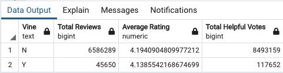
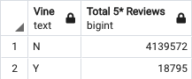
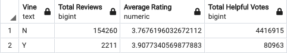

# Alexa, Can You Handle Big Data?

Prepared by Corey Lawson-Enos

## Overview
Google Colab Notebooks and SQL code that completes ETL processes for Amazon review datasets in the cloud, and uploads them as DataFrames to an RDS instance for analysis. Question: Are reviews from reviewers in Amazon's Vine program trustworthy? Disparate datasets selected for testing are Jewelry and Toys.

## Technologies
Amazon Web Services: RDS and S3; pgAdmin; SQL; PySpark; Google Colab Notebook

## Resources
Amazon Review Data Sources (file download):

    - Jewelry: https://s3.amazonaws.com/amazon-reviews-pds/tsv/amazon_reviews_us_Jewelry_v1_00.tsv.gz
    - Toys: https://s3.amazonaws.com/amazon-reviews-pds/tsv/amazon_reviews_us_Toys_v1_00.tsv.gz

## Summary
Jewelry and Toys review datasets were cleaned and combined using PySpark, and uploaded to an Amazon Web Services RDS instance for aggregation in SQL. Reviews are grouped according to particicpation in Amazon's Vine program, where reviewers receive free products in exchange for reviews. Summary tables as follows, used to evaluate if bias and/or discrepancy can be shown when comparing Vine participants against the general public. 

### Aggregate Summary
* Average ratings appear consistent between Vine participants/non-participants.
* Vine member reviews garnered an average 2.6 helpful votes, compared to 1.3 for non-members.

### 5-Star Reviews
* Only 41% of Vine program reviews are 5-star, compared to 63% for the general public.

### Reviews' Helpful Votes
* To reduce noise, records were filtered for a minimum ten (10) helpful votes.
* Applying this fitler, average ratings were slightly higher for Vine participants, although by slim margin.
* However, at this reduced noise level, Vine member reviews garnered an average 36.6 helpful votes, compared to 28.6 for non-members.

## Analysis
Although average ratings remain roughly consistent between Vine members and non-members, it is observed that Vine members are much less likely to award 5-stars the non-members. To achieve comparable ratings averages, the stars they award must cluster more closely to the 4.12 and adjusted 3.91 averages observed. Since 63% of the general public's reviews in these datasets are 5-star, a signicant number of their balance must be lower 1- and 2-star ratings to take their averages down to approximate the same figures as Vine members. Two possible trends may be observed, both of which could work together in concert with each other to produce the observed effect:

* A) That the general public is much more polar with their reviews--either very critical or very positive--and that Vine members are more thoughtful and provide more balanced, nuanced ratings; or
* B) That Vine members are much less inclined to provide negative reviews, suggesting that repeat negative reviews might present apparent risk to program participation and its benefits.

## Source

Amazon customer Reviews Dataset. (n.d.). Retrieved April 08, 2021, from: https://s3.amazonaws.com/amazon-reviews-pds/readme.html

## Contact
E-mail: clawson131@gmail.com 
LinkedIn: https://www.linkedin.com/in/corey-lawson-enos/
